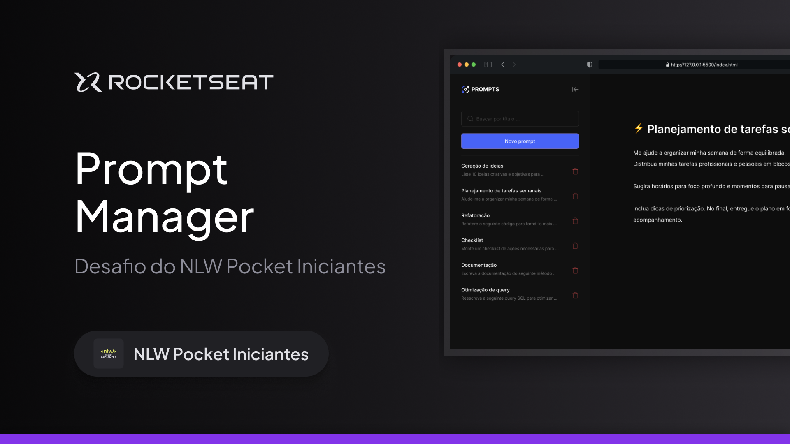

<h1 id="topo" align="center">Prompt Manager</h1>

 

 

<a href="#sobre">Sobre </a>&nbsp;&nbsp;•&nbsp;&nbsp;
<a href="#funcionalidades">Funcionalidades </a>&nbsp;&nbsp;•&nbsp;&nbsp;
<a href="#layout">Layout </a>&nbsp;&nbsp;•&nbsp;&nbsp;
<a href="#tecnologias">Tecnologias </a>&nbsp;&nbsp;•&nbsp;&nbsp;
<a href="#comoexecutar">Como executar </a>&nbsp;&nbsp;•&nbsp;&nbsp;
<a href="#autor">Autor </a>&nbsp;&nbsp;•&nbsp;&nbsp;
<a href="#contribuidores">Contribuidores </a>&nbsp;&nbsp;•&nbsp;&nbsp;
<a href="#licenca">Licença </a>

 

<h2>💻 Sobre o projeto</h1>

Gerenciador de prompts que consiste em guardar seus prompts para serem usados mais tarde.

Esse projeto foi criado no evento NLW Pocket Iniciantes da Rocketseat para aprender como usar a IA para ter mais produtividade durante o estudo.

<h2>⚙️ Funcionalidades</h2>

- [x] Criar prompt;
- [x] Editar prompt:
- [x] Copiar prompt;
- [x] Salvar prompt;
- [x] Excluir prompt;

<h2>🎨 Layout</h2>

O Layout da aplicação está disponível no Figma:

<h2>🛠 Tecnologias Utilizadas</h2>

As seguintes ferramentas foram usadas na construção do projeto:

<ul>
  <li>HTML;</li>
  <li>CSS;</li>
  <li>JavaScript;</li>
  <li>Figma MCP;</li>
  <li>Github Copilot.</li>
</ul>

<h2>📋 Como executar o projeto</h2>

Clone o repositório e abra o projeto no navegador ou abra o projeto no vscode e utilize a extensão Live Server

  <h2>🧙‍♂️ Autor</h2>
  
  

  
  <a href="https://github.com/thiagoguidi1">
   
    
   <b>Thiago Guidi</b></a> 
    

 

<h2>📝 Licença</h2>

Esse projeto está sob a <strong>licença MIT</strong>.

 

  <h3>Feito com ❤️ por <a href="https://github.com/thiagoguidi1"><strong>Thiago Guidi</strong></a>👋🏽 <a href="https://www.linkedin.com/in/thiagoguidi/"><em>Entre em Contato!</em></a></h3>

 

  

